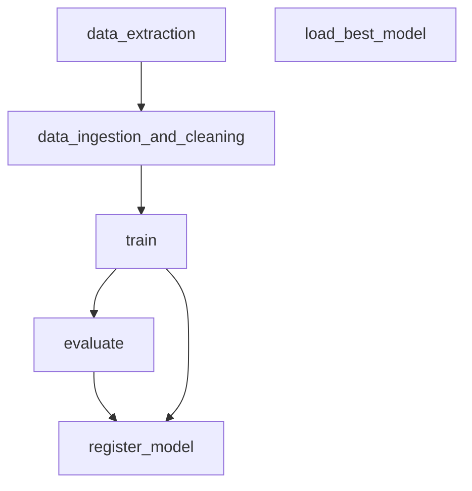

```mermaid
flowchart TD
	node1["data_extraction"]
	node2["data_ingestion_and_cleaning"]
	node3["evaluate"]
	node4["register_model"]
	node5["train"]
	node1-->node2
	node2-->node5
	node3-->node4
	node5-->node3
	node5-->node4
	node6["load_best_model"]
```